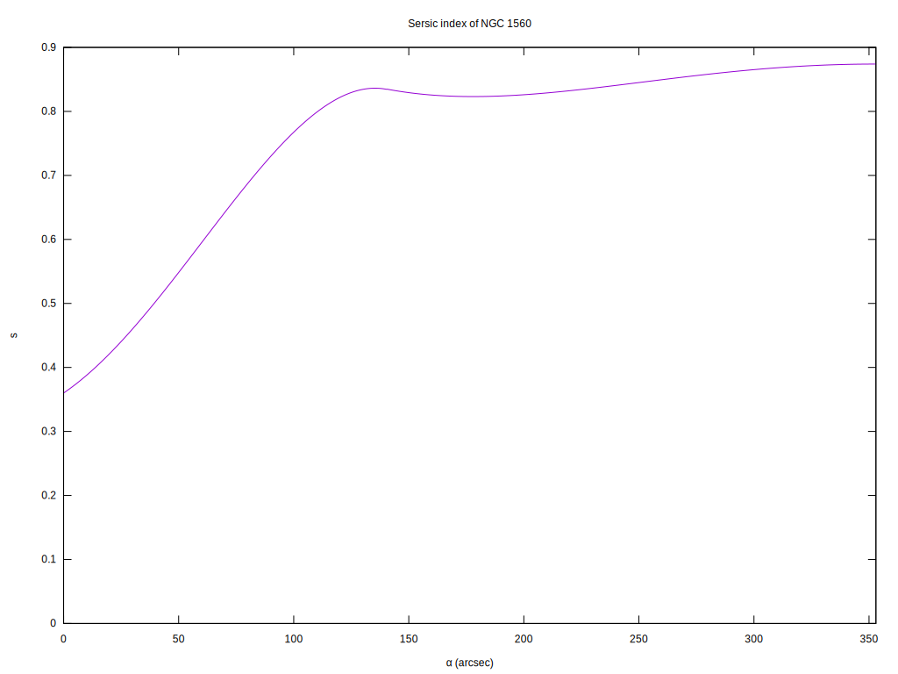
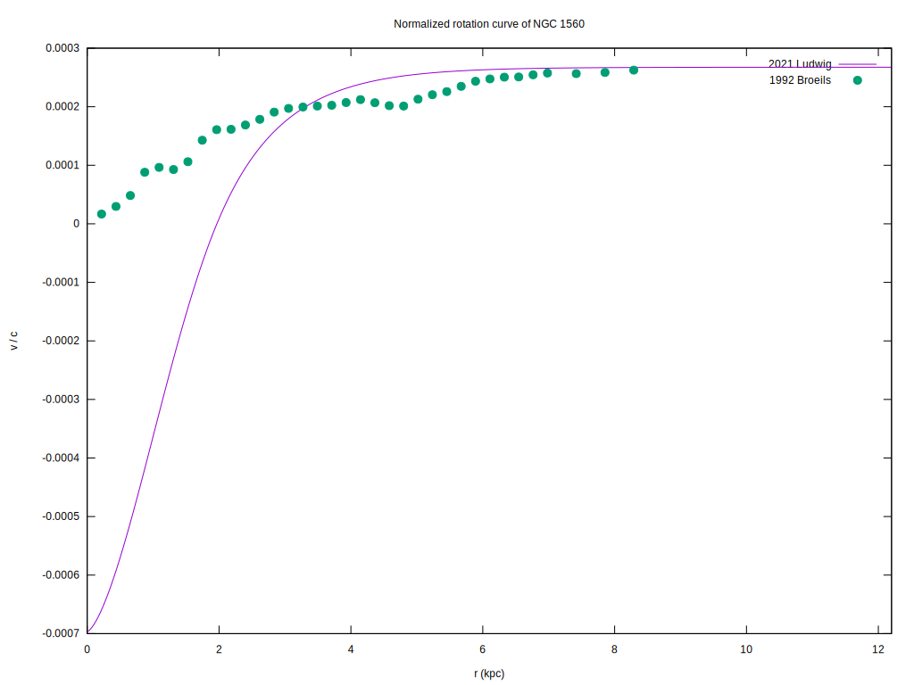
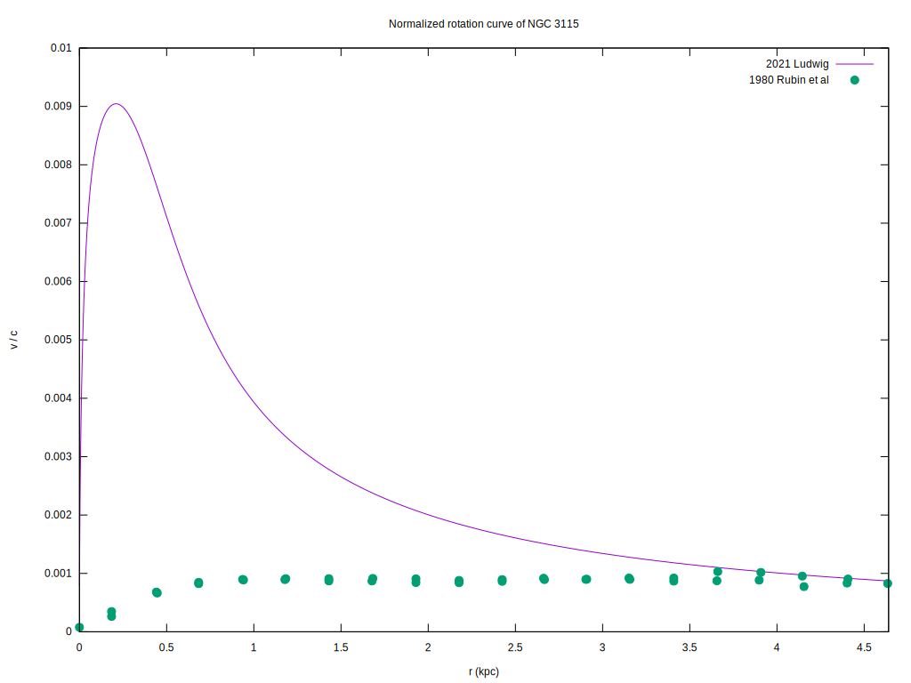

I'm trying to reproduce the graphs in 2021 Ludwig. 

Seems the paper isn't very clear where it gets its graphs from (no explicit description of the rotation curve graph whatsoever) or on what equation the parameters that it lists are used in.

Errors I think I've found:
* NGC 3115 y0 = 4.0 instead of 0.4 makes the graph look correct.  Especially since NGC 3198 has a value of 8.0, in the same range.
* Eqn 9.1b says `r / r0` but should say `r / reff` ... and maybe have a finally piecewise segment for `se`.

### NGC 1560 ###

For NGC 1560 there are two sets of functions/parameters, one in section 7 and one in appendix D.  seems the parameters and figures in one section are sometimes used in the other section, and there's no clear indication of which is used where.

CHECK:	Fig 1a: NGC 1560 - rotation velocity of a spheroid

CHECK:	Fig 1a: NGC 1560 - sampled rotation velocity of spheroid from 1992 Broeils 

CHECK:	Fig 1b: NGC 1560 mass density

CHECK:	Fig 1b: NGC 1560 gravitational potential

CHECK:	Fig 2a: NGC 1560 circular velocity of a spheroid vs fig1a velocity of spheroid

CHECK:	Fig 2a: NGC 1560 - sampled rotation velocity of spheroid from 1992 Broeils 

CHECK:	Fig 2b: NGC 1560 luminosity profile

CHECK:	Fig 2b: NGC 1560 - sampled luminosity from 1992 Broeils table 3

CHECK:	Fig 3a: NGC 1560 luminosity profile, adjusted, using the Appendix D variables .. this graph's equation is a mess of pieces from the paper.

CHECK:	Fig 3a: NGC 1560 - sampled luminosity from 1992 Broeils table 3

CHECK:	Fig 3b: NGC 1560 Sersic index ... I bet my code or the paper has a typo somewhere ... 

CHECK:	Fig 4a: NGC 1560 normalized mass density (using eqn D 13)

CHECK:	Fig 4a: NGC 1560 - sampled luminosity from 1992 Broeils

TODO:	Fig 4b: NGC 1560 normalized rotation curve (well, it's not the eqn 5.3 ... so where do they get it from?)

This should be reproducable once the norm mass density and grav pot are done -- then just substitute both into Abel's equation (might not be the same as those provided in eqn 5.2) and ... viola?

CHECK:	Fig 5a: NGC 1560 galactic width.

FIXME:	Fig 5b: NGC 1560 gravitational potential 

TODO:	Fig 5b: NGC 1560 d/dr of gravitational potential

### NGC 3198 ###

Luckily for this galaxy the author didn't divide his information between two separate sections.

CHECK:	Fig 6a:	NGC 3198 luminosity profile function.

CHECK:	Fig 6a: NGC 3198 - sampled luminosity from 1987 Kent ... I have *a* 1987 Kent paper, but it doesn't have the same data, maybe it's not *the* Kent paper? 

CHECK:	Fig 6b: NGC 3198 Sersic index. Using the variables he provides does produce a discontinuity at the boundary of the piecewise segments of the function, and recalculating the coefficients using the equations provided fixed this.

CHECK: 	Fig 7a: NGC 3198 normalized mass density corrected for high mass-to-light ratio population.

TODO:	Fig 7a:	NGC 3198 normalized mass density matching measured values.

CHECK:	Fig 7a: NGC 3198 - sampled normalized mass density from 1987 Kent .. can't find the values in the paper

FIXME:	Fig 7b: NGC 3198 normalized rotation curve

CHECK:	Fig 7b: NGC 3198 - sampled rotation curve from 1989 Begeman

I also reconstructed the cited 2006 Cooperstock et al paper's rotation curve, however the fitted function looks like it is a different model than the 2021 Ludwig rotation curve graph.

Probably because I need to solve the Abel equations with NGC 3198's normrho and normph, and normphi is based on the galactic width ...

CHECK:	Fig 8a: NGC 3198 galactic width.

FIXME:	Fig 8b:	NGC 3198 gravitational potential 

FIXME:	Fig 8b:	NGC 3198 gravitational potential derivative.

### NGC 3115 ###

CHECK:	Fig 9a:	NGC 3115 luminosity profile.

CHECK:	Fig 9a: NGC 3115 - sampled luminosity from 1987 Capaccioli et al.

CHECK:	Fig 9b:	NGC 3115 Sersic index.

CHECK:	Fig 10a: NGC 3115 normalized mass density corrected for high mass-to-light ratio population 

CHECK:	Fig 10a: NGC 3115 - sampled normalized mass density from 1987 Capaccioli et al.  1987 Capaccioli et al doesn't have these values.  How were they computed for 2021 Ludwig?

TODO	Fig 10a: NGC 3115 normalized mass density matching the samples 

FIXME:	Fig 10b: NGC 3115 normalized rotation curve. 

CHECK:	Fig 10b: NGC 3115 - sampled rotation curve from 1980 Rubin.

CHECK:	Fig 11a: NGC 3115 galactic width. 

FIXME:	Fig 11b: NGC 3115 gravitational potential

FIXME:	Fig 11b: NGC 3115 gravitational potential derivative

FIXME:	Fig 12a: NGC 3115 normalized mass density with modified schwarzschild radius. 

CHECK:	Fig 12a: NGC 3115 - sampled normalized mass density from 1987 Capaccioli et al.

FIXME:	Fig 12b: NGC 3115 normalized rotation curve with modified schwarzschild radius. 

CHECK:	Fig 12b: NGC 3115 - sampled rotation curve from 1980 Rubin.

